  

  <picture>
    <source
      media="(prefers-color-scheme: dark)"
      srcset="https://readme-typing-svg.demolab.com/?font=Press+Start+2P&pause=1000&center=true&vCenter=true&width=650&height=40&color=7CFC00&lines=mining+new+features;stacking+C%2B%2B+%2F+.NET+%2F+Python;shipping+PRs+to+PowerToys"
    />
    
  </picture>

I'm a CS & Engineering student who spends most of his time in low-level and systems code, and lately in the open-source trenches of Microsoft PowerToys.

### currently placing blocks on

- **[PowerToys — active PR](https://github.com/microsoft/PowerToys/pull/46786)** · a multi-threaded C++ file-conversion module for the Windows context menu.
- **[Local Semantic File Search](https://github.com/Pikachu-5/local-semantic-file-search)** · a sub-100ms hybrid search engine over your files, built with Python, C#, and LanceDB.
- **[Hybrid CPU/GPU Raytracing Engine](https://github.com/Pikachu-5/hybrid-cpu-gpu-raytracing-engine)** — real-time ray tracing at 40 FPS using AVX2 SIMD and OpenVINO upscaling.
- **[ETS2 Driver Intelligence](https://github.com/Pikachu-5/ETS2)** · records real Euro Truck Simulator 2 sessions, scores the drive, replays it — 141 tests, no faked numbers.
- **[Recover](https://github.com/Pikachu-5/razorpay)** · built at a Razorpay buildathon — an agentic monitor that diagnoses failed payments, verifies the root cause, and fires off recovery, fully traced.
- **Neural Internet Memory Engine** *(WIP)* — turns desktop activity into a temporal vector-memory graph, using LangGraph.
- **[Lunar Crater and Depth Detector](https://github.com/Pikachu-5/lunar-crater-detector-and-depth-estimator)** — terrain reconstruction pipeline: YOLOv11 crater detection plus sensorless depth estimation.
- **Multi-Cloud Kubernetes Platform** — a self-managed cluster spanning AWS and GCP with zero-trust networking.

### crafting table

  
   
  
   
  

### how to reach me

  
  
  

